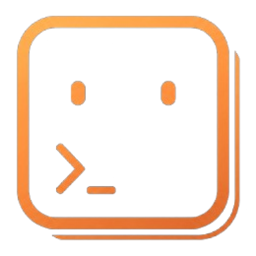
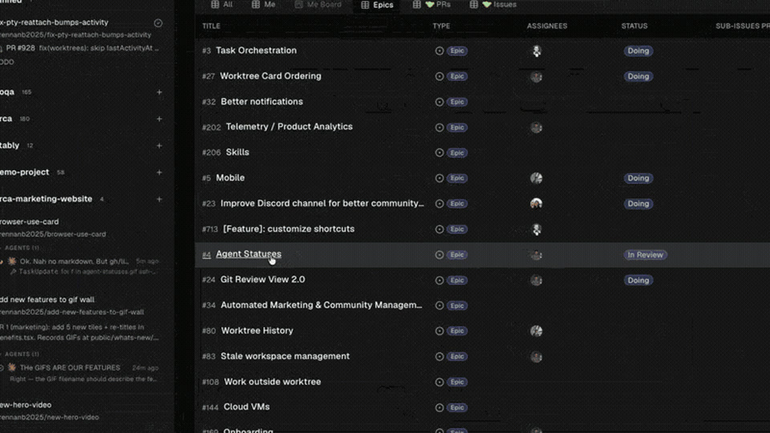
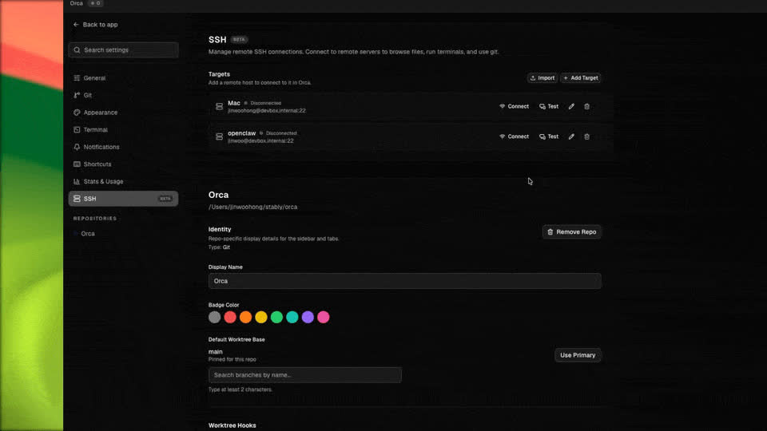

<h1 align="center">
  <a href="https://github.com/lsjfy-open-com/orca-china"></a> Orca China
</h1>

<p align="center">
  
  
  <a href="https://github.com/stablyai/orca"></a>
</p>

<p align="center">
  <a href="README.md">简体中文</a> · <a href="https://github.com/stablyai/orca">上游 Orca</a>
</p>

<p align="center">
  <strong>面向中文用户的 Orca 汉化与独立打包版本。</strong><br/>
  并行运行 Claude Code、OpenClaude、Codex、Grok、Gemini、Antigravity、OpenCode 等 CLI 智能体，每个任务运行在独立 worktree 中，并在一个工作台内统一跟踪。<br/>
  支持 <strong>macOS、Windows 和 Linux</strong>。
</p>

<p align="center">
  <a href="#安装"><strong>下载安装</strong></a>
</p>


## 支持的智能体

Orca China 支持任意 CLI 智能体（_不限于下列工具_）。

<p>
  <a href="https://docs.anthropic.com/claude/docs/claude-code"><kbd> Claude Code</kbd></a> &nbsp;
  <a href="https://openclaude.gitlawb.com/"><kbd> OpenClaude</kbd></a> &nbsp;
  <a href="https://github.com/openai/codex"><kbd> Codex</kbd></a> &nbsp;
  <a href="https://x.ai/cli"><kbd> Grok</kbd></a> &nbsp;
  <a href="https://github.com/google-gemini/gemini-cli"><kbd> Gemini</kbd></a> &nbsp;
  <a href="https://antigravity.google/docs/cli-overview"><kbd> Antigravity</kbd></a> &nbsp;
  <a href="https://pi.dev"><kbd> Pi</kbd></a> &nbsp;
  <a href="https://omp.sh"><kbd> oh-my-pi</kbd></a> &nbsp;
  <a href="https://hermes-agent.nousresearch.com/docs/"><kbd> Hermes Agent</kbd></a> &nbsp;
  <a href="https://opencode.ai/docs/cli/"><kbd> OpenCode</kbd></a> &nbsp;
  <a href="https://block.github.io/goose/docs/quickstart/"><kbd> Goose</kbd></a> &nbsp;
  <a href="https://ampcode.com/manual#install"><kbd> Amp</kbd></a> &nbsp;
  <a href="https://docs.augmentcode.com/cli/overview"><kbd> Auggie</kbd></a> &nbsp;
  <a href="https://github.com/autohandai/code-cli"><kbd> Autohand Code</kbd></a> &nbsp;
  <a href="https://github.com/charmbracelet/crush"><kbd> Charm</kbd></a> &nbsp;
  <a href="https://docs.cline.bot/cline-cli/overview"><kbd> Cline</kbd></a> &nbsp;
  <a href="https://www.codebuff.com/docs/help/quick-start"><kbd> Codebuff</kbd></a> &nbsp;
  <a href="https://commandcode.ai/docs/quickstart"><kbd> Command Code</kbd></a> &nbsp;
  <a href="https://docs.continue.dev/guides/cli"><kbd> Continue</kbd></a> &nbsp;
  <a href="https://cursor.com/cli"><kbd> Cursor</kbd></a> &nbsp;
  <a href="https://docs.factory.ai/cli/getting-started/quickstart"><kbd> Droid</kbd></a> &nbsp;
  <a href="https://docs.github.com/en/copilot/how-tos/set-up/install-copilot-cli"><kbd> GitHub Copilot</kbd></a> &nbsp;
  <a href="https://kilo.ai/docs/cli"><kbd> Kilocode</kbd></a> &nbsp;
  <a href="https://www.kimi.com/code/docs/en/kimi-code-cli/getting-started.html"><kbd> Kimi</kbd></a> &nbsp;
  <a href="https://kiro.dev/docs/cli/"><kbd> Kiro</kbd></a> &nbsp;
  <a href="https://github.com/mistralai/mistral-vibe"><kbd> Mistral Vibe</kbd></a> &nbsp;
  <a href="https://github.com/QwenLM/qwen-code"><kbd> Qwen Code</kbd></a> &nbsp;
  <a href="https://support.atlassian.com/rovo/docs/install-and-run-rovo-dev-cli-on-your-device/"><kbd> Rovo Dev</kbd></a>
</p>

---

## 功能特性

- **无需登录 Orca 账号**：直接使用你自己的 Claude Code、OpenClaude、Codex、Grok、Gemini 或 Antigravity 等订阅与 CLI。
- **原生 worktree 工作流**：每个任务都有独立 worktree，减少 stash 和频繁切分支的干扰。
- **多智能体终端**：在标签页和分屏中并行运行多个 AI 编程智能体，并快速查看活跃状态。
- **内置源代码管理**：查看 AI 生成的 diff、快速编辑，并在 Orca China 内完成提交。
- **代码托管集成**：将 PR、issue、Actions 检查等信息关联到对应 worktree。
- **SSH 支持**：连接远程机器，并从 Orca China 中运行远程智能体工作流。
- **通知与未读状态**：智能体完成任务或需要关注时及时提醒，方便稍后回到上下文。

## Orca China 变更说明

本分支基于上游 Orca 做了面向中文用户的本地化与独立打包调整：

- 将应用名称、包名、安装产物和命令行入口隔离为 **Orca China** / `orca-china`，避免覆盖或破坏已安装的上游 Orca。
- 新增完整 i18n 基础设施，集中管理英文与简体中文文案，并支持 UI 文案兜底翻译。
- 覆盖主界面、项目添加流程、侧边栏、设置页导航，以及设置页各 pane 中的常见静态文案。
- 按 AI 与计算机领域常用表达统一术语，例如“智能体”“AI 服务商账号”“智能体编排”“计算机控制”“工作区”“源代码管理”“遥测”等。
- 更新 Windows、macOS、Linux 打包脚本和发布产物命名，生成 `orca-china-*` 系列安装包与 CLI 启动器。

---

## 安装

### Windows

推荐分发编译产物中的安装包：

- **安装版**：`dist/orca-china-windows-setup.exe`
- **便携版**：`dist/Orca China-<version>-win.zip`

不要直接分发 `dist/win-unpacked/Orca China.exe`。它依赖同目录下的 Electron 运行时文件，单独复制这个 exe 通常无法启动。

### macOS 与 Linux

当前仓库已经保留 macOS 和 Linux 的独立应用标识、产物命名与 `orca-china` CLI 启动器。请使用本仓库构建产物，不要使用上游 Orca 的下载地址。

### 本地构建

```bash
corepack pnpm install
corepack pnpm run build

# Windows 打包
corepack pnpm run build:win
```

---

## 移动端伴侣应用

移动端伴侣应用来自上游 Orca，可用于从手机控制智能体。

<p align="center">
  <picture><source srcset="docs/assets/feature-wall/mobile-companion-app-showcase.gif" type="image/gif"></picture>
</p>

- **iOS:** [从 App Store 下载](https://apps.apple.com/us/app/orca-ide/id6766130217)
- **Android:** [从上游 GitHub Releases 下载 APK](https://github.com/stablyai/orca/releases/download/mobile-v0.0.11/app-release.apk)

---

## 上游功能展示

以下展示内容来自上游 Orca，用于了解核心工作流。

<p align="center">
  <a href="https://www.onorca.dev/docs/model/worktrees"><kbd><strong>Parallel Worktrees</strong><br/><br/><picture><source srcset="docs/assets/feature-wall/parallel-worktrees.gif" type="image/gif"></picture><br/></kbd></a> &nbsp;&nbsp;
  <a href="https://www.onorca.dev/docs/terminal"><kbd><strong>Terminal Splits</strong><br/><br/><picture><source srcset="docs/assets/feature-wall/terminal-splits.gif" type="image/gif"></picture><br/></kbd></a><br/><br/>
  <a href="https://www.onorca.dev/docs/browser/design-mode"><kbd><strong>Design Mode</strong><br/><br/><picture><source srcset="docs/assets/feature-wall/design-mode.gif" type="image/gif"></picture><br/></kbd></a> &nbsp;&nbsp;
  <a href="https://www.onorca.dev/docs/review/linear"><kbd><strong>GitHub &amp; Linear, Native</strong><br/><br/><picture><source srcset="docs/assets/feature-wall/github-linear.gif" type="image/gif"></picture><br/></kbd></a><br/><br/>
  <a href="https://www.onorca.dev/docs/agents/supported"><kbd><strong>Every CLI Agent</strong><br/><br/><picture><source srcset="docs/assets/feature-wall/cli-agents.gif" type="image/gif"></picture><br/></kbd></a> &nbsp;&nbsp;
  <a href="https://www.onorca.dev/docs/ssh"><kbd><strong>SSH Worktrees</strong><br/><br/><picture><source srcset="docs/assets/feature-wall/ssh-worktrees.gif" type="image/gif"></picture><br/></kbd></a><br/><br/>
  <a href="https://www.onorca.dev/docs/editing/file-explorer"><kbd><strong>Drag Files to Agents</strong><br/><br/><picture><source srcset="docs/assets/feature-wall/file-drag.gif" type="image/gif"></picture><br/></kbd></a> &nbsp;&nbsp;
  <a href="https://www.onorca.dev/docs/review/annotate-ai-diff"><kbd><strong>Annotate AI Diffs</strong><br/><br/><picture><source srcset="docs/assets/feature-wall/annotate-diff.gif" type="image/gif"></picture><br/></kbd></a><br/><br/>
  <a href="https://www.onorca.dev/docs/cli/overview"><kbd><strong>Orca CLI</strong><br/><br/><picture><source srcset="docs/assets/feature-wall/orca-cli.gif" type="image/gif"></picture><br/></kbd></a> &nbsp;&nbsp;
  <a href="https://www.onorca.dev/docs/settings"><kbd><strong>Native Search</strong><br/><br/><picture><source srcset="docs/assets/feature-wall/keyboard-native.gif" type="image/gif"></picture><br/></kbd></a><br/><br/>
  <a href="https://www.onorca.dev/docs/agents/usage-tracking"><kbd><strong>Account Switcher &amp; Usage Tracking</strong><br/><br/><picture><source srcset="docs/assets/feature-wall/codex-accounts.gif" type="image/gif"></picture><br/></kbd></a> &nbsp;&nbsp;
  <a href="https://www.onorca.dev/docs/editing/markdown"><kbd><strong>Rich Repo Previews</strong><br/><br/><picture><source srcset="docs/assets/feature-wall/markdown-editor.gif" type="image/gif"></picture><br/></kbd></a><br/><br/>
  <a href="https://www.onorca.dev/docs/model/tabs-panes-splits"><kbd><strong>Split Anything</strong><br/><br/><picture><source srcset="docs/assets/feature-wall/split-screen.gif" type="image/gif"></picture><br/></kbd></a>
</p>

---

## 社区与支持

- **Orca China 仓库:** [lsjfy-open-com/orca-china](https://github.com/lsjfy-open-com/orca-china)
- **上游 Orca:** [stablyai/orca](https://github.com/stablyai/orca)
- **上游社区:** 通过 **[Discord](https://discord.gg/fzjDKHxv8Q)** 参与 Orca 社区讨论。
- **反馈与想法:** Orca China 相关问题请优先在本仓库反馈；上游功能建议可提交到 [stablyai/orca issues](https://github.com/stablyai/orca/issues)。
- **隐私与遥测:** 匿名使用数据说明见上游 [privacy & telemetry docs](https://www.onorca.dev/docs/telemetry)。

---

## 开发

想参与开发或在本地运行？请参考 [CONTRIBUTING.md](.github/CONTRIBUTING.md)。
